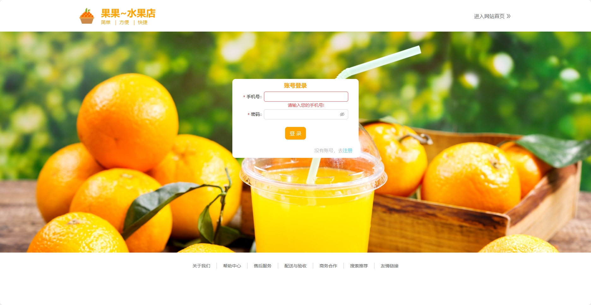
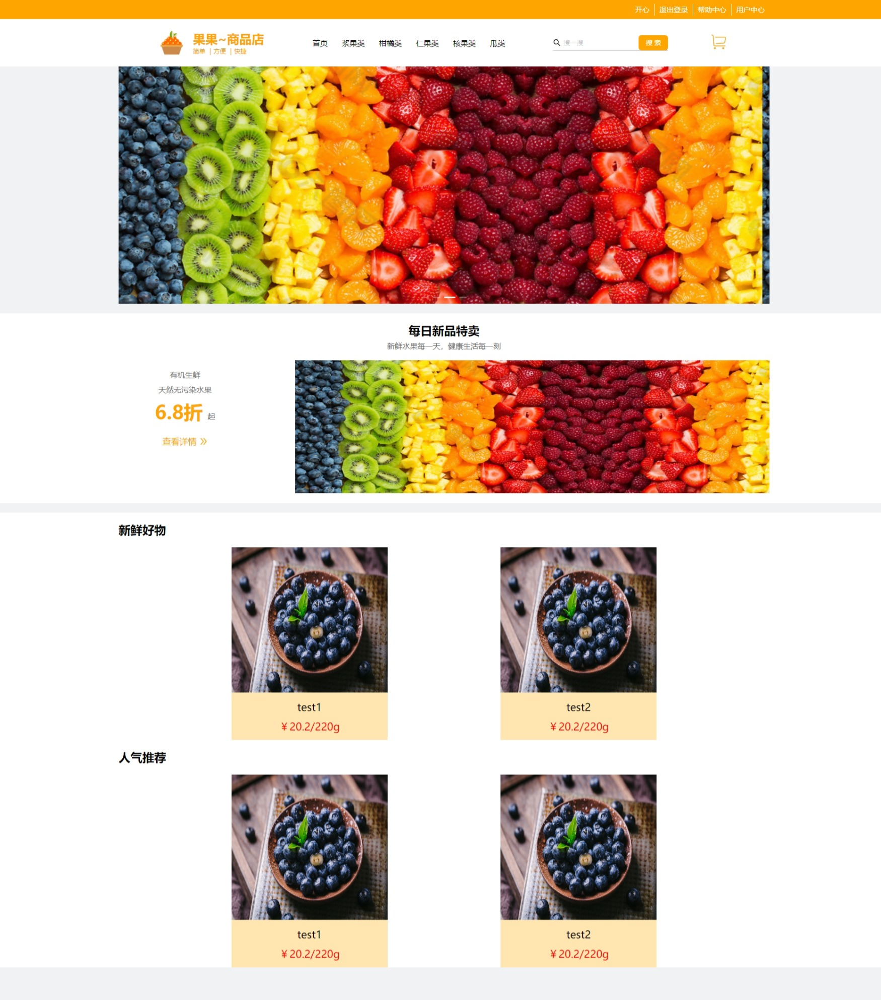
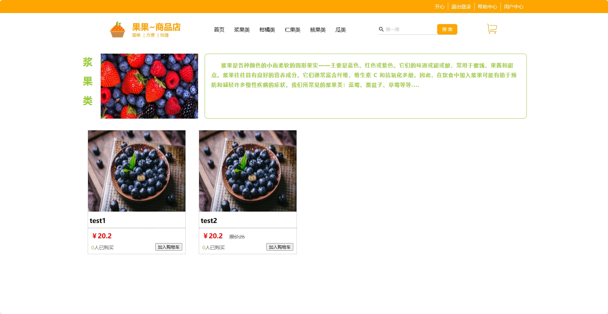
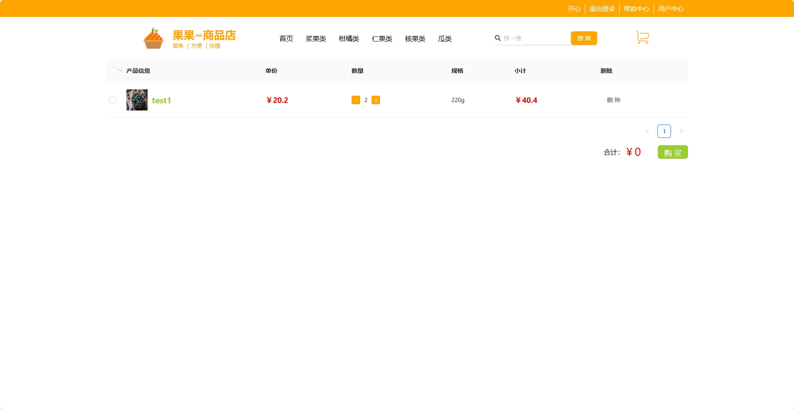
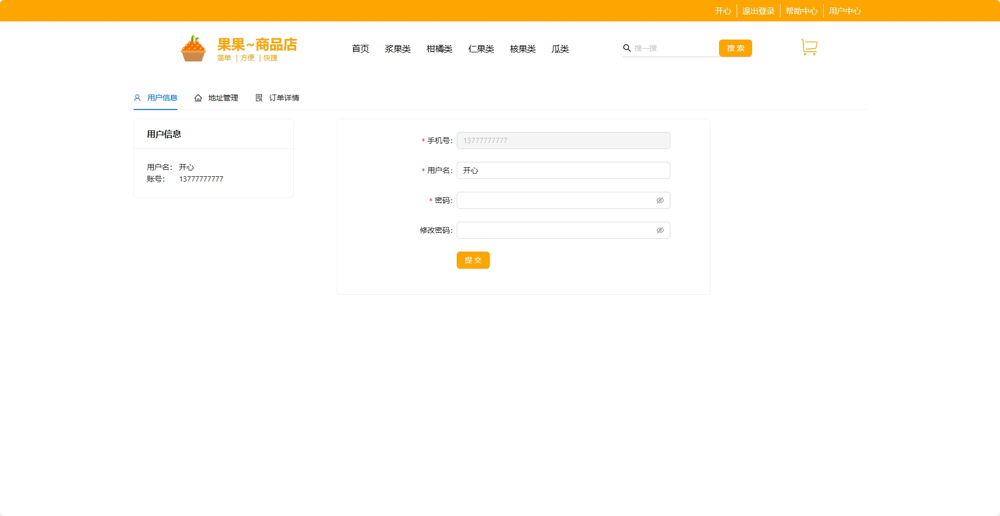
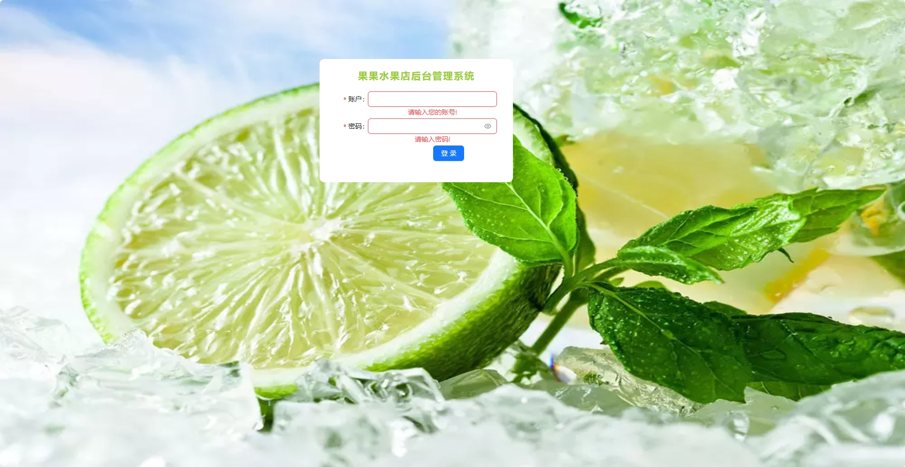
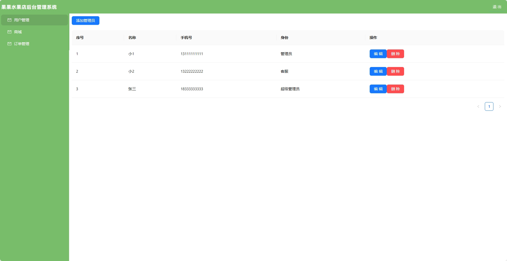
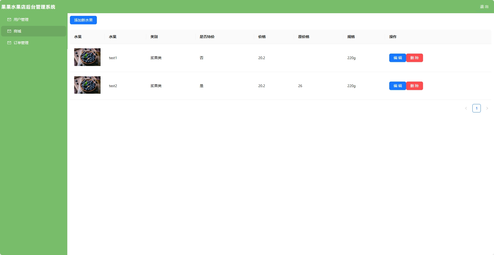
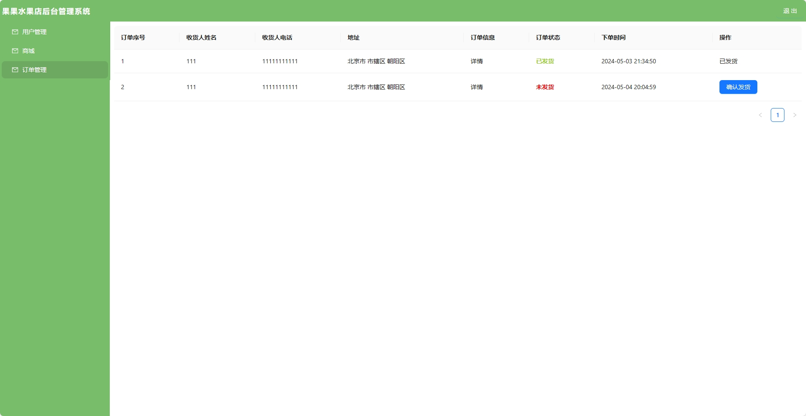

<!-- 1. 关于mongodb
   1. 需要自己下载mongodb(我的版本是5.0.25)
   2. 启动项目之前需要先启动你的mongodb服务端
   3. server.js 中mongoose.connect('mongodb://127.0.0.1:27017/fruit_shopping')需要修改mongodb://127.0.0.1:27017一般不会改变，fruit_shopping是你创建库的名字
2. 关闭后端
   1. 后端采用的是node.js
   2. 跨域用const cors = require('cors');解决，后续随着技术学习可能会改变
3. 关于前端
   1. 前端目前有一些评论等功能没有实现，后续可能会更新
4. 关于启动
   1. 每一个项目都需要进行npm i(根目录、mall下、background下)
   2. 由于使用了concurrently，进行了配置，所以进入跟目录下 npm run dev 就可以全部启动
    -->

# 水果商城
[](https://github.com/777qing/react-fruit-project) [](https://github.com/777qing/react-fruit-project) [](https://github.com/777qing/react-fruit-project)


基于Express、MongoDB、React、Axios、Ant Design 实现。 
## 前台
1. 商城用户登录注册，用户信息编辑；
3. 商城根据水果类型进行分类，实现搜索水果名称筛选水果；
2. 商品加入购物车和下订单功能（支付功能后续考虑接入支付宝或者微信）；
## 后台管理
1. 管理员的注册和登录，管理员信息编辑；
2. 商品模块水果商品的查询、上传、编辑和删除功能；
3. 订单模块查询订单信息和确认订单状态的功能（后续考虑扩展订单状态返回快递号等功能）

## 项目运行
```shell
git clone https://github.com/777qing/react-fruit-project.git 

npm run dev
```

## 项目截图
1. 商城登录页


2. 商城首页


3. 商城分类


4. 购物车


4. 用户信息


4. 后台登录页


4. 后台管理员信息页面


4. 后台水果管理页面


4. 后台订单管理页面

